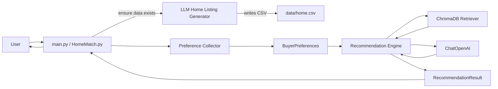

# Architecture (Recruiter-Friendly)

## Overview
This project is a small GenAI-native application that recommends real-estate homes using:
* **RAG** (Retrieval-Augmented Generation) via **ChromaDB**
* an LLM (**ChatOpenAI**) to write the final recommendation
* a resilient startup path that **auto-generates** `data/home.csv` when missing

## Flow (3-layer model)

## Key quality gates
- **Secrets are validated at startup** via `pydantic-settings` (fail-fast).
- **Untrusted user text is sanitized** before it is inserted into prompts.
- **Unit tests** are included for critical pure logic (sanitization, validation, parsing).

